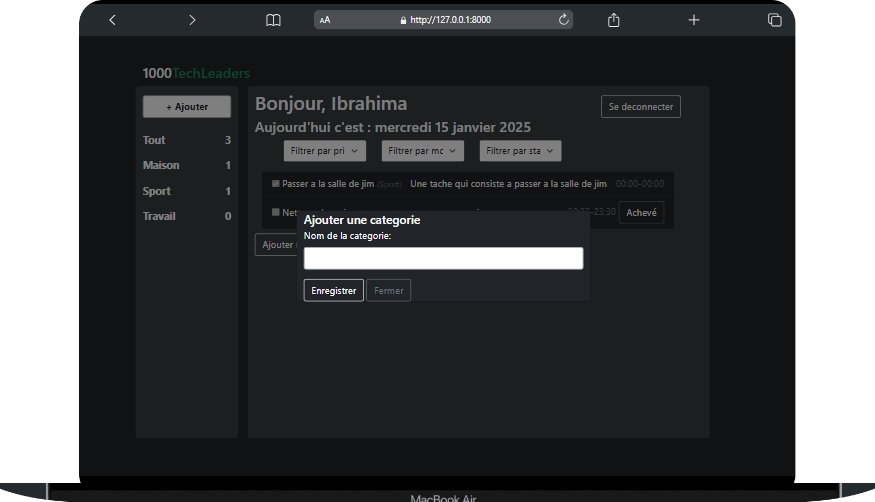
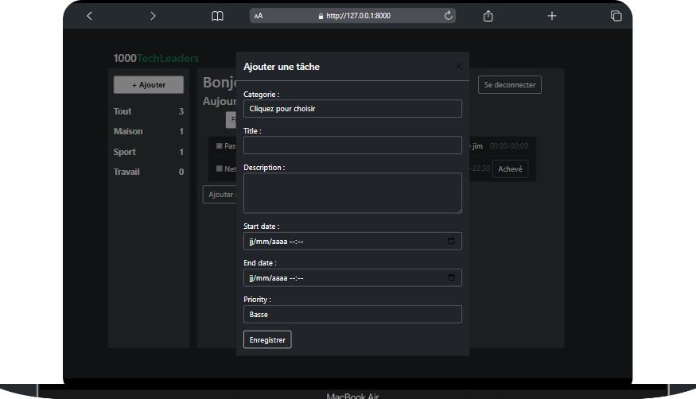
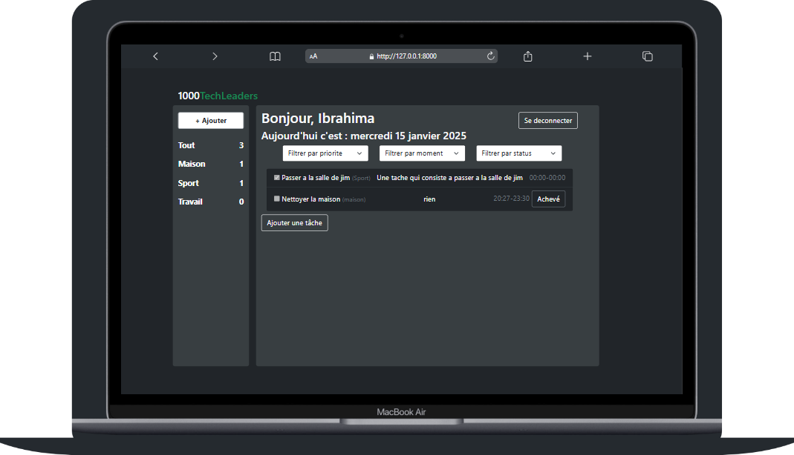

# 00_todolist
Un projet de gestion de tache fait avec Django

## Fonctionnalités

- **Inscription et deconnexion** : Pour l'utiliser l'application l'utilisateur doit s'inscrire ou se connecter

- **Ajouter des categories** : Les utilisateurs peuvent ajouter des categories via un modal et voir la liste des categories sous forme de Menu a gauche


- **Ajouter des taches** : Les utilisateurs peut ajouter des taches via un modal en cliquant sur le bouton ajouter


- **Gerer les taches** : Ils peuvent voir toutes les taches, achever les taches, filtrer par categorie, par priorite, par moment, filtrer par status


## Fonctionnalitées a venir
- **Gerer la responsivité**

- **Ecrire les tests pour chaque  fonctionnalites**

- **Deployer le projet**

## Prérequis

Avant de commencer, assurez-vous d'avoir les prérequis suivants installés :

- Python 3.x
- Django 5.1.1 ou version supérieure
- pip (pour installer les dépendances)

## Installation

1. Clonez le dépôt :

    ```bash
    git clone https://github.com/ibdems/00_todolist
    ```

2. Accédez au dossier du projet :

    ```bash
    cd 00_todolist
    ```

3. Créez un environnement virtuel :

    ```bash
    python -m venv venv
    ```

4. Activez l'environnement virtuel :
    - Sur Windows :

    ```bash
    venv\Scripts\activate
    ```
    - Sur macOS/Linux :

    ```bash
    source venv/bin/activate
    ```

5. Installez les dépendances :

    ```bash
    pip install -r requirements.txt
    ```

6. Appliquez les migrations pour créer la base de données :

    ```bash
    python manage.py migrate
    ```

7. Créez un superutilisateur pour accéder à l'administration Django :

    ```bash
    python manage.py createsuperuser
    ```

8. Démarrez le serveur de développement :

    ```bash
    python manage.py runserver
